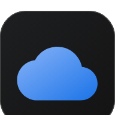

# ☁️ CloudDrive — Zero-Knowledge Multi-Cloud Storage Platform

<div align="center">



**Transform Discord & Telegram into an Unlimited, Ultra-Fast, Zero-Knowledge Encrypted Private Cloud Drive.**

[](LICENSE)
[](https://nodejs.org/)
[](https://www.docker.com/)
[](#security--encryption)
[](#progressive-web-app-pwa)

</div>

---

## 🌟 Key Highlights & Features

- 🛡️ **Server-Managed Multi-Tenant Encryption**: Files are encrypted using **AES-256-GCM AEAD** with per-user and per-chunk keys before uploading. Protect the application database and environment secrets because this is not a zero-knowledge design.
- ⚡ **Multi-Cloud Dual Storage & Failover**: Stores encrypted chunks redundantly across **Discord** and **Telegram** with configurable upload strategies (Primary First + Background Sync or Parallel Dual Upload).
- 🚀 **High-Throughput Chunking Engine**: Dynamically chunks files (from 9.5MB up to 450MB) supporting unlimited multi-GB file transfers with pause, resume, and parallel upload streams.
- 📁 **Native WebDAV Network Drive**: Mount your CloudDrive directly as a native network drive in Windows File Explorer, macOS Finder, Linux, and mobile file managers (CX File Explorer / Owlfiles).
- 📱 **Progressive Web App (PWA)**: Installable on iPhone/iPad (iOS fullscreen Safari), Android, and Desktop with offline caching, background upload wake-locks, and native sharing.
- 🌐 **Full Multilingual Typography**: Native UTF-8 Unicode support with specialized Google Fonts for **Bengali (বাংলা)**, **Russian (Русский)**, and international character sets.
- 🧰 **Standalone Offline Decryption Suite**: Recover and decrypt files 100% offline using the standalone Web GUI (`index.html`) or CLI (`decrypt.js`) without needing the server.

---

## 📋 System Architecture

```
┌──────────────────────────────────────────────────────────────────┐
│                   CloudDrive Web & WebDAV Client                 │
│         (Browser UI / iOS PWA / Windows Explorer / macOS)        │
└────────────────────────────────┬─────────────────────────────────┘
                                 │ HTTPS / WebDAV / WebSocket
                                 ▼
┌──────────────────────────────────────────────────────────────────┐
│                     CloudDrive Node.js Core                      │
│   ├── In-Memory AES-256-GCM Crypto Engine (Zero-Disk Spill)      │
│   ├── Multi-Cloud Policy & Replication Queue Worker              │
│   ├── Embedded SQLite Database (sql.js / Zero-Config)            │
│   └── LRU Local Streaming Cache (Pruned up to 3 GB)              │
└──────────────────┬─────────────────────────────┬─────────────────┘
                   │                             │
                   ▼                             ▼
   ┌─────────────────────────────┐┌──────────────────────────────┐
   │    Discord Storage Cloud    ││    Telegram Storage Cloud    │
   │  (Bot API / Storage Channel)││ (MTProto GramJS / Bot API)   │
   └─────────────────────────────┘└──────────────────────────────┘
```

---

## 🚀 1. Quick Start: Localhost

### Prerequisites
- [Node.js](https://nodejs.org/) v18 or v20+
- [Git](https://git-scm.com/)

### Installation & Run
```bash
# 1. Clone the repository
git clone https://github.com/mdraihannewaz/clouddrive.git
cd clouddrive

# 2. Install dependencies
npm install

# 3. Create your environment configuration
cp .env.example .env

# 4. Start the server
npm start
```

Open your browser and navigate to: **`http://localhost:3000`**

---

## 🐳 2. Quick Start: Docker & Docker Compose

Deploy instantly with isolated persistent storage:

```bash
# 1. Copy and configure .env
cp .env.example .env

# 2. Build and launch with Docker Compose
docker compose up -d --build

# 3. View live server logs
docker compose logs -f
```

The container automatically persists your database, sessions, and cache inside `./data`.

---

## 🌐 3. Production VPS Deployment Guide (Ubuntu / Debian)

### Step 1: Install Docker on your VPS
```bash
sudo apt update && sudo apt upgrade -y
sudo apt install -y curl git ufw

# Install Docker Engine & Compose plugin
curl -fsSL https://get.docker.com -o get-docker.sh
sudo sh get-docker.sh
sudo usermod -aG docker $USER
```

### Step 2: Clone Repository & Configure Environment
```bash
cd /opt
sudo git clone https://github.com/mdraihannewaz/clouddrive.git
cd clouddrive
sudo cp .env.example .env
sudo nano .env
```

Fill in your Discord and Telegram credentials in `.env`:
```env
PORT=3000
NODE_ENV=production
JWT_SECRET=generate_a_random_32_char_secret
ENCRYPTION_KEY=generate_a_random_32_char_master_key

# Discord Settings
DISCORD_BOT_TOKEN=your_bot_token
DISCORD_GUILD_ID=your_server_id
DISCORD_CHANNEL_ID=your_storage_channel_id

# Telegram Settings
TELEGRAM_API_ID=your_api_id
TELEGRAM_API_HASH=your_api_hash
TELEGRAM_BOT_TOKEN=your_bot_token
TELEGRAM_CHANNEL_ID=your_channel_id
```

### Step 3: Launch with Docker Compose
```bash
docker compose up -d --build
```

### Step 4: Nginx Reverse Proxy with SSL (Let's Encrypt)
Install Nginx and Certbot:
```bash
sudo apt install -y nginx certbot python3-certbot-nginx
```

Create `/etc/nginx/sites-available/clouddrive`:
```nginx
server {
    server_name drive.yourdomain.com;

    client_max_body_size 500M;
    client_body_timeout 300s;

    location / {
        proxy_pass http://127.0.0.1:3000;
        proxy_http_version 1.1;
        proxy_set_header Upgrade $http_upgrade;
        proxy_set_header Connection "upgrade";
        proxy_set_header Host $host;
        proxy_set_header X-Real-IP $remote_addr;
        proxy_set_header X-Forwarded-For $proxy_add_x_forwarded_for;
        proxy_set_header X-Forwarded-Proto $scheme;
        proxy_read_timeout 600s;
        proxy_send_timeout 600s;
        proxy_buffering off;
        proxy_request_buffering off;
    }
}
```

Enable site & obtain SSL certificate:
```bash
sudo ln -s /etc/nginx/sites-available/clouddrive /etc/nginx/sites-enabled/
sudo nginx -t
sudo systemctl reload nginx
sudo certbot --nginx -d drive.yourdomain.com
```

---

## 🗄️ 4. Native WebDAV Network Drive Setup

CloudDrive includes a built-in RFC 4918 compliant WebDAV server:

| Platform | Connection URL | Username / Password |
| :--- | :--- | :--- |
| **Windows Explorer** | `https://drive.yourdomain.com/webdav` | Your CloudDrive Email / Password |
| **macOS Finder** | `https://drive.yourdomain.com/webdav` | Your CloudDrive Email / Password |
| **Linux (davfs2)** | `https://drive.yourdomain.com/webdav` | Your CloudDrive Email / Password |
| **iOS / Android** | Owlfiles / CX File Explorer / FE File | Your CloudDrive Email / Password |

---

## 🛡️ 5. Standalone Offline Decryption Suite

If your server or hosting ever goes down, your files on Discord and Telegram remain 100% recoverable:

1. **Browser GUI**: Double-click [`Tools/Decryption/index.html`](Tools/Decryption/index.html) in any browser without needing Node.js or internet.
2. **CLI Utility**:
   ```bash
   node Tools/Decryption/decrypt.js single \
     --input "rai_IMG_6091.MOV.enc" \
     --output "IMG_6091.MOV" \
     --key "YOUR_ENCRYPTION_KEY" \
     --file-id "FILE_UUID" \
     --chunk 0 \
     --iv "IV_BASE64" \
     --tag "AUTH_TAG_BASE64"
   ```
3. **Batch Recovery**:
   ```bash
   node Tools/Decryption/decrypt.js from-manifest \
     --manifest emergency_manifest.json \
     --key "YOUR_ENCRYPTION_KEY" \
     --enc-dir ./downloads \
     --out-dir ./recovered_files
   ```

---

## 📄 License
This project is licensed under the [MIT License](LICENSE).
